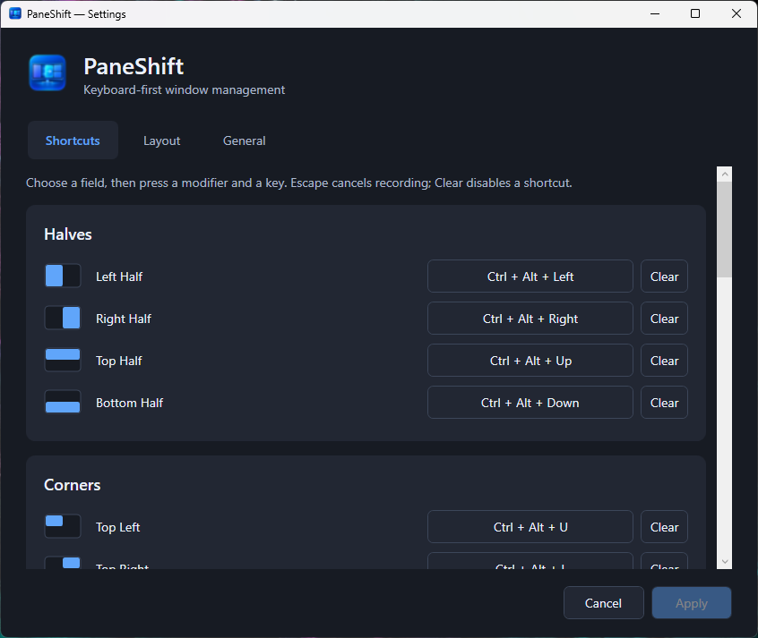
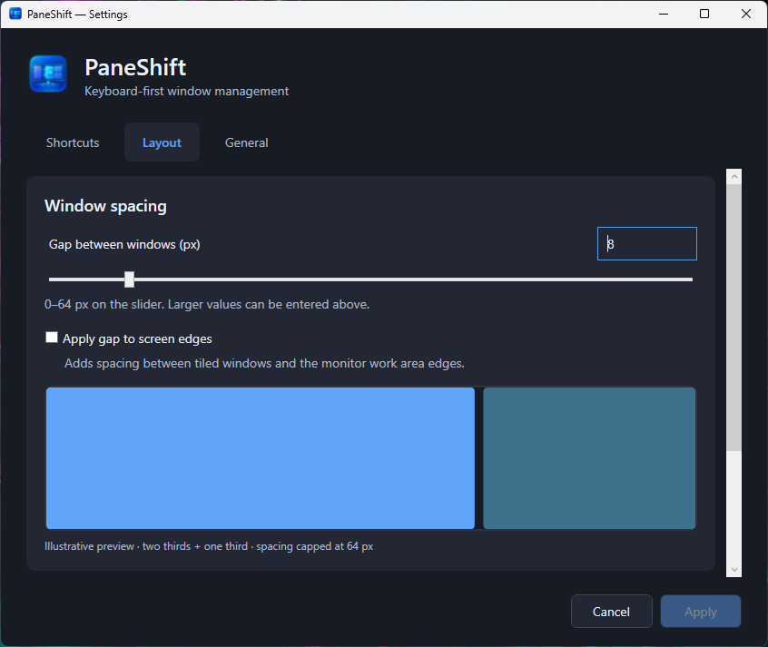
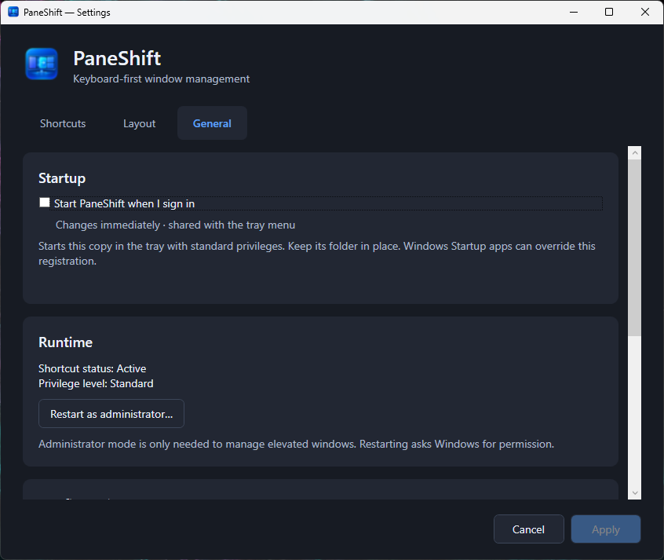

<p align="center">
  
</p>

# PaneShift

**Keyboard-first window management for Windows.**

Arrange windows with configurable shortcuts, precise layouts and adjustable spacing. PaneShift lives in your notification area and keeps its settings in a native Windows interface.

[Explore the website](https://ken5998.github.io/PaneShift/) · [Download PaneShift](https://github.com/Ken5998/PaneShift/releases/latest)

[](https://github.com/Ken5998/PaneShift/releases)
[](https://dotnet.microsoft.com/)
[](LICENSE)
[](https://github.com/Ken5998/PaneShift/actions/workflows/ci.yml)
[](https://github.com/Ken5998/PaneShift/releases/latest)

<table>
  <tr>
    <td width="50%"></td>
    <td width="50%"></td>
  </tr>
  <tr><td align="center">Your shortcuts, your layouts</td><td align="center">Precise spacing in physical pixels</td></tr>
</table>

## Features

- Halves, corners, thirds, two-thirds and all six sixths, plus Maximize, Center and Restore.
- Repeated half shortcuts cycle **1/2 → 2/3 → 1/3** along the same edge.
- Repeated third, two-thirds and sixth shortcuts cycle horizontally while keeping the same size and row.
- Configurable hotkeys with a keyboard recorder, explicit clearing and duplicate detection.
- Adjustable gaps between windows and optional spacing at monitor work-area edges.
- Multi-monitor work-area geometry, negative monitor coordinates and Per-Monitor V2 DPI awareness.
- Native WPF Settings with light/dark appearance, draft editing and Apply/Cancel.
- Safe configuration reload and hotkey changes: failed activation preserves working settings.
- Tray pause/resume and explicit administrator restart for elevated windows.
- Optional start at sign-in, shared between the tray menu and General settings.

An independent MIT-licensed implementation inspired by Rectangle's positioning workflow on macOS. No Rectangle code, branding or assets are reused.

## Installation

**Requires Windows 11 x64.** Release packages include the .NET runtime; users do not need to install .NET separately.

Download the installer or portable ZIP from the [latest published GitHub release](https://github.com/Ken5998/PaneShift/releases/latest). **[PaneShift v0.1.1](https://github.com/Ken5998/PaneShift/releases/tag/v0.1.1)** adds horizontal shortcut cycling; see the [0.1.1 release notes](docs/RELEASE_NOTES_0.1.1.md).

Or install/update from PowerShell without administrator rights:

```powershell
irm https://paneshift.ksmvc.ch/win | iex
```

The script downloads the latest published installer from GitHub, verifies it against the release's SHA-256 checksum, closes an installed PaneShift instance when necessary, performs a silent per-user install/update, and launches PaneShift afterward. Use `& ([scriptblock]::Create((irm https://paneshift.ksmvc.ch/win))) -NoLaunch` to leave it closed, or add `-Force` to reinstall the current version. As with every `irm | iex` command, inspect [the script](https://paneshift.ksmvc.ch/win.ps1) first if desired.

| Package | How to use it |
| --- | --- |
| `PaneShift-<version>-Setup-x64.exe` | Install for the current user, normally in `%LOCALAPPDATA%\Programs\PaneShift`. Start Menu shortcut is optional; desktop shortcut is unchecked by default. |
| `PaneShift-<version>-win-x64.zip` | Extract **all** files into a folder, then run `PaneShift.App.exe`. No installation needed. |
| `SHA256SUMS.txt` | SHA-256 hashes of the final installer and ZIP. Compare using `Get-FileHash -Algorithm SHA256`. |

Exit a running copy before installing an update or switching between installed and portable builds. A second copy cannot run alongside the first. The portable build uses the same per-user configuration location as the installed build.

Normal installation does not request administrator privileges. Uninstall removes installed application files and shortcuts, while preserving your configuration. Startup at sign-in is off until you enable it in the app; uninstall removes its entry only when it points to that installed copy. An auto-updater is not implemented.

## Default shortcuts

The following use **Ctrl + Alt**:

| Key | Action |
| --- | --- |
| Left / Right | Left / Right Half |
| Up / Down | Top / Bottom Half |
| U / I | Top Left / Top Right |
| J / K | Bottom Left / Bottom Right |
| D / F / G | First / Center / Last Third |
| E / R / T | First / Center / Last Two Thirds |
| Enter | Maximize |
| C | Center, preserving size |

**Ctrl + Shift + Win + Up / Down** place the Top Right / Bottom Right Sixth. There are 18 default bindings. The remaining four sixth actions and Restore can be assigned in Settings.

Release each chord before repeating it. Repeated halves cycle sizes on the same target. Thirds and two-thirds move through the horizontal positions; sixths stay in their top or bottom row. Another action, another target, pause or a failed command resets the sequence. Restore keeps the window's original placement for the current PaneShift session.

## Settings

PaneShift starts in the notification area, possibly inside its overflow menu. Right-click its icon and choose **Settings...**, or double-click the icon. Reopening activates the same Settings window; closing it leaves the tray app running.

- **Shortcuts:** select a field, press modifiers and a key, or choose Clear. Escape cancels recording. Duplicates block Apply; reset-to-default changes only the draft.
- **Layout:** edit the physical-pixel gap, toggle screen-edge gaps and inspect the preview. The slider covers 0–64 px; direct input accepts larger nonnegative values. Cycle sizes is the currently supported repetition mode.
- **General:** toggle start at sign-in, check shortcut/privilege status, open the configuration file/folder, restore defaults, open the repository or request administrator restart.

**Start PaneShift when I sign in** is available in the tray menu and General. This Windows preference changes immediately in both places, independently of Apply/Cancel and Restore defaults for JSON settings. It registers the current executable for your user account, starts in the tray with standard privileges, and needs no administrator rights. Keep the executable's folder in place, especially for portable builds. If you move it, enable startup from the new copy. The checkbox refers to the current copy; enabling it replaces an older PaneShift location. Windows Startup apps can disable the registration separately. Debug builds and elevated instances cannot edit this preference; use a normal Release instance.

**Apply** validates, saves and activates the draft without restarting. If a new hotkey is unavailable or saving fails, working settings and registrations remain active. **Cancel** discards edits; closing with unsaved changes prompts you first. No changes are written on every keystroke.

<p></p>

Configuration is stored at:

```text
%LOCALAPPDATA%\PaneShift\settings.json
```

The tray's **Open Settings File** reveals the JSON in Explorer. After editing it, choose **Reload Settings**. A valid reload updates layout and hotkeys, preserves Restore history and pause state, and resets repeated-command cycles. Failed reloads retain the last working configuration. Unsaved GUI edits are preserved with an explicit reload prompt. There is no file watcher or background polling.

Existing JSON files without a `hotkeys` section retain the original defaults. Individual entries can be set to `null` to disable a binding. See the [configuration reference](docs/SETTINGS.md) for the schema, gaps and reload details.

The Settings window uses Windows light/dark application colors when opened; reopen it after changing Windows appearance.

## Security and code signing

**The v0.1.1 packages are unsigned.** SignPath Foundation integration is ready to configure after acceptance, but no current signing status is assumed. Each release's notes state its actual signing status and link to SHA-256 checksums. See the [code signing policy](docs/CODE_SIGNING.md).

Optional VirusTotal reports refer to the final downloadable files. Public VirusTotal submissions are public samples; reports are informational and false positives are possible. There is no fixed-hash VirusTotal badge or unverified clean-scan claim.

PaneShift itself does not transmit user information to network services during normal window management. The explicit repository button opens GitHub in your browser. No telemetry, automatic updater, global keyboard hook, DLL injection or process-memory manipulation is used.

PaneShift runs normally with standard privileges. To control elevated windows, explicitly choose **Restart as administrator...** and respond to Windows UAC. Cancelling keeps the current instance running. To return to standard privileges, Exit and launch from a standard Explorer session. Elevation does not guarantee access to every protected window.

Apps can enforce minimum sizes or reject placement. Game/fullscreen compatibility and unusual display configurations require testing; use **Pause shortcuts** when needed.

## Building from source

Requires Windows and the **.NET 10 SDK** with Windows desktop targeting support:

```powershell
dotnet restore PaneShift.sln
dotnet build PaneShift.sln -c Release
dotnet test PaneShift.sln -c Release --no-build
dotnet run --project src/PaneShift.App
```

To produce the self-contained ZIP, Inno Setup installer and checksums:

```powershell
$iscc = ./scripts/Install-InnoSetup.ps1
./scripts/Build-Release.ps1 -IsccPath $iscc
```

Use PowerShell 7. The helper installs a verified, pinned Inno Setup compiler under ignored `artifacts/tools`. If already installed, pass your compiler path instead. See [release instructions](docs/RELEASING.md) for versioning, artifacts, signing and GitHub draft releases.

## Architecture

| Project | Responsibility |
| --- | --- |
| `PaneShift.Core` | Pure physical-pixel geometry, settings/chord models, validation, persistence and repetition state |
| `PaneShift.Windows` | Win32/DWM positioning, transactional hotkeys, privilege detection and restart handoff |
| `PaneShift.App` | WPF lifecycle and Settings; Windows Forms only for the tray icon/menu |
| `PaneShift.Core.Tests` / `PaneShift.Windows.Tests` | Geometry, settings, transactional rollback, draft state and Windows-support logic |

Read the [architecture notes](docs/ARCHITECTURE.md), [manual regression checklist](docs/TESTING.md), and [release acceptance checklist](docs/RELEASING.md#release-acceptance-checklist). The current application suite contains 583 tests; release-script validation is separate and does not require signing credentials or global hotkey availability.

## License

[MIT License](LICENSE) — Copyright © 2026 Kenan Kasumović. Bundled .NET runtime files retain their upstream license notices. PaneShift's original icon assets are documented in [assets/README.md](assets/README.md).
